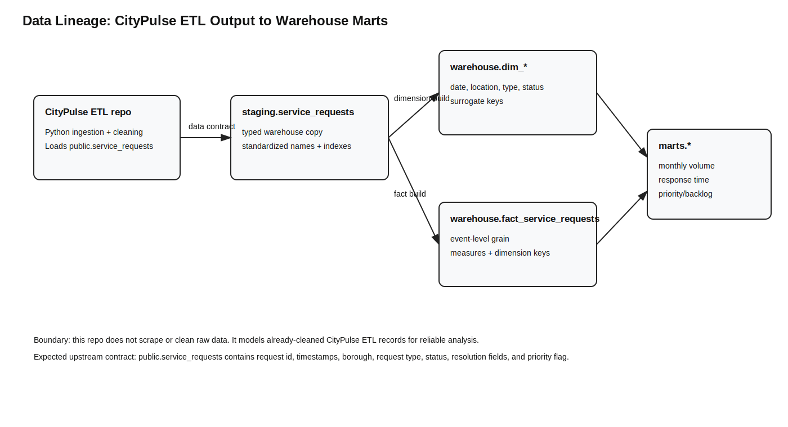
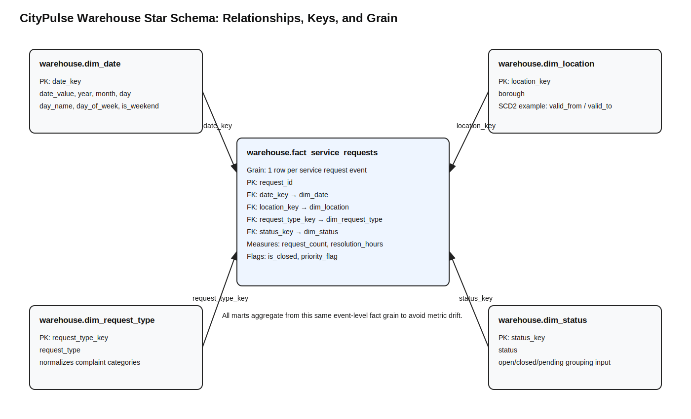
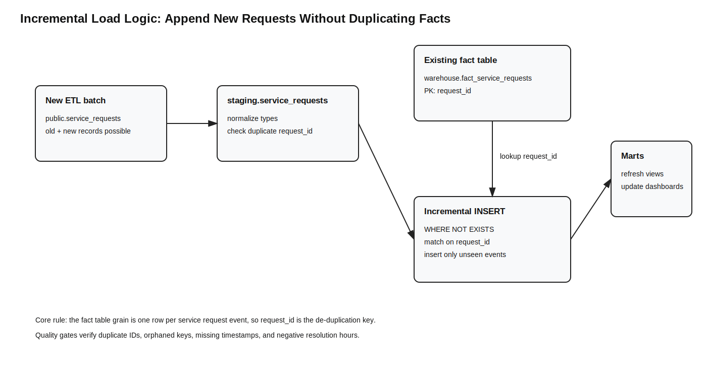
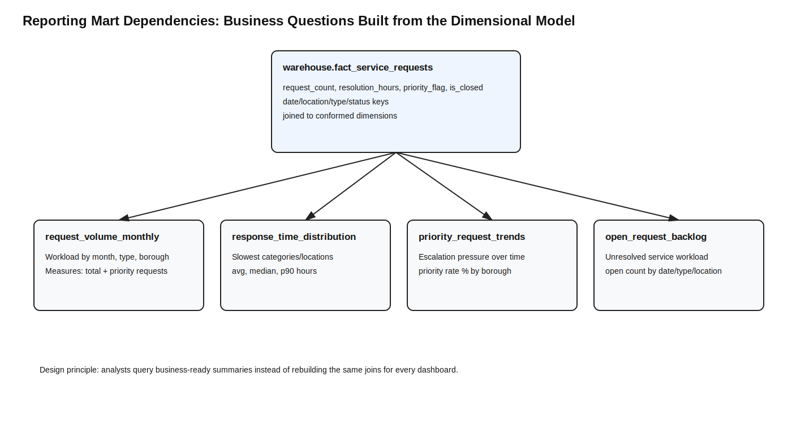

# CityPulse Analytics Warehouse

CityPulse Analytics Warehouse is a PostgreSQL dimensional warehouse that extends the CityPulse ETL pipeline. The upstream CityPulse ETL project ingests and cleans municipal service request data; this repository models that cleaned output into staging tables, conformed dimensions, an event-level fact table, quality checks, and reporting marts.

The goal is not to make a decorative warehouse demo. The goal is to show the mechanics of an analytics engineering system: table grain, schema boundaries, lineage, incremental loading, dimensional joins, and mart-level outputs tied to specific analytical questions.

## System Boundary

This repository starts after CityPulse ETL has loaded cleaned records into PostgreSQL.

Expected upstream table:

```sql
public.service_requests
```

Warehouse output layers:

```text
staging.service_requests
warehouse.dim_date
warehouse.dim_location
warehouse.dim_request_type
warehouse.dim_status
warehouse.fact_service_requests
marts.request_volume_monthly
marts.response_time_distribution
marts.priority_request_trends
marts.open_request_backlog
```

## What the Warehouse Answers

The reporting layer is designed around operational analytics questions:

- Which request types create the largest monthly workload?
- Which boroughs have the slowest response times?
- How does priority-request volume change over time?
- Which request categories create the largest open backlog?
- Which dimensions are needed to support consistent dashboard metrics?

## Data Lineage



The lineage diagram shows the actual dependency boundary: CityPulse ETL loads cleaned records, this warehouse imports those records into staging, and the dimensional layer creates fact and dimension tables for reporting.

## Dimensional Model



The warehouse uses a star schema. The fact table grain is:

> one row per service request event

This grain is important because every mart aggregates from the same event-level table. Request counts, backlog counts, priority-rate calculations, and response-time metrics all come from the same consistent base.

## Incremental Load Strategy



The incremental load example uses request-level duplicate protection. New staging records are inserted into the fact table only when their `request_id` does not already exist in `warehouse.fact_service_requests`.

This is intentionally simple and explainable: it demonstrates the main idea behind append-safe warehouse refreshes without introducing a full orchestration framework.

## Reporting Mart Dependencies



The mart layer converts the dimensional model into business-ready tables for common analysis patterns: monthly volume, response time distributions, priority trends, and open backlog.

## Repository Structure

```text
CityPulse-Analytics-Warehouse/
├── assets/                         # Four high-information diagrams
├── docs/                           # Grain, lineage, modeling, and interview notes
├── scripts/                        # Build scripts and sample-data utilities
├── sql/
│   ├── integration/                # Import cleaned CityPulse ETL output
│   ├── staging/                    # Staging schema setup
│   ├── warehouse/                  # Dimensions, fact table, constraints, SCD2 example
│   ├── incremental/                # Incremental fact load pattern
│   ├── marts/                      # Reporting marts/materialized views
│   ├── quality/                    # Data quality, grain, and integrity checks
│   └── analytics/                  # Example analyst queries
├── docker-compose.yml
└── README.md
```

## How to Run

Start PostgreSQL:

```powershell
docker compose up -d
```

Run the integrated build after CityPulse ETL has loaded `public.service_requests`:

```powershell
scripts\run_full_lineage_build.ps1
```

Or run directly with psql:

```powershell
psql -h localhost -U citypulse -d citypulse -f sql/run_citypulse_integrated_build.sql
```

## Build Order

```text
1. Create staging schema
2. Import cleaned CityPulse ETL records from public.service_requests
3. Create warehouse dimensions
4. Create warehouse fact table
5. Add primary/foreign key constraints
6. Demonstrate incremental fact loading logic
7. Create reporting marts
8. Run data quality and integrity checks
```

## Key SQL Artifacts

| File | Purpose |
|---|---|
| `sql/integration/import_from_citypulse_etl.sql` | Imports the upstream ETL output into staging |
| `sql/warehouse/create_dimensions.sql` | Builds date, location, request type, and status dimensions |
| `sql/warehouse/create_fact_service_requests.sql` | Builds the event-level fact table |
| `sql/warehouse/add_constraints.sql` | Adds primary/foreign key relationships and integrity constraints |
| `sql/incremental/load_fact_incremental.sql` | Demonstrates append-safe fact loading |
| `sql/warehouse/scd2_dim_location.sql` | Shows a focused SCD Type 2 location-history pattern |
| `sql/marts/create_reporting_views.sql` | Creates operational reporting marts |
| `sql/quality/data_quality_checks.sql` | Runs staging, warehouse, and mart quality checks |
| `sql/quality/grain_validation.sql` | Verifies fact-table grain is not violated |
| `sql/quality/dimension_integrity_checks.sql` | Checks fact-to-dimension conformance |

## Design Decisions

- Staging isolates upstream ETL output from warehouse modeling logic.
- The warehouse uses surrogate keys in dimensions but keeps `request_id` as the fact-table natural event identifier.
- Reporting marts are materialized views because the same aggregations would be reused by dashboards or analysts.
- Incremental loading is demonstrated with request-level duplicate protection rather than a complex orchestration tool.
- The SCD2 script is included as a focused design example for tracking changes in descriptive dimension attributes.

## Limitations

- The warehouse runs locally in PostgreSQL rather than a managed cloud warehouse.
- The incremental example is append-focused and does not implement late-arriving updates.
- The SCD2 script demonstrates the concept but is not a full production dimension-management framework.
- The project is SQL-script orchestrated rather than Airflow/dbt managed.

## Future Improvements

- Add dbt models and tests
- Add Airflow or Prefect orchestration
- Add late-arriving record handling
- Add CI checks for SQL syntax and data-quality tests
- Add a dashboard layer using Metabase, Superset, or Streamlit

## Author

Zachary Amachee  
CIS @ Baruch College  
Data Engineering • Analytics Engineering • Applied Analytics
